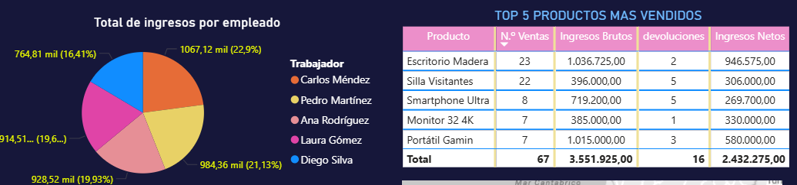

# 📊 Dashboard Nexus Shop - Análisis Comercial Interactivo

## 🎯 Resumen Ejecutivo
Dashboard interactivo desarrollado en Power BI para el análisis integral de Nexus Shop, permitiendo exploración de datos en tiempo real mediante filtros avanzados por categoría, ubicación, período y equipo comercial.

## 📸 Vistas del Dashboard

### 1. Vista General Completa

**Vista panorámica con todos los módulos interconectados:**
- Filtros globales por categoría, año y ubicación
- KPIs principales de ventas e ingresos netos
- Distribución de ingresos por empleado 
- Tabla de top 5 productos más vendidos
- Mapa de distribución geográfica por total de ventas

### 2. Análisis de Tendencias Temporales  

**Evolución de ingresos netos y volumen de ventas:**
- Seguimiento mensual desde Enero hasta Diciembre
- Identificación de picos estacionales (Febrero: 987.7K, Mayo: 499.5K)
- Correlación entre ingresos y número de ventas
- Tendencia estable con variaciones mensuales estratégicas

### 3. Desempeño por Equipo y Productos

**Análisis comparativo de rendimiento comercial:**
- **Distribución porcentual** por empleado:
  - Carlos Méndez: 22.9% (1.07M)
  - Pedro Martínez: 21.13% (984.36K)
  - Ana Rodríguez: 16.41% (764.81K)
  - Laura Gómez: 19.65% (928.52K)
  - Diego Silva: 19.62% (914.5K)
- **Top 5 productos** por ingresos netos:
  - Escritorio Madera: 946.5K (23 ventas)
  - Portátil Gaming: 580K (7 ventas)
  - Monitor 32 4K: 330K (7 ventas)
  - Silla Visitantes: 306K (22 ventas)
  - Smartphone Ultra: 269.7K (8 ventas)

### 4. Segmentadores en Acción - Filtros Avanzados

**Demostración del poder de análisis específico aplicando múltiples filtros:**
- **🔧 Filtro Categoría:** Solo "Tecnología"
- **📅 Filtro Año:** Período "2024"
- **📊 Resultado:** Vista específica mostrando:
  - Laura Gomez: 355.2K (45.56%)
  - Diego Silva: 189.45K (22.7%)
  - Top 5 productos tecnológicos vendidos en Madrid durante 2024

## 🔧 Funcionalidades de Filtrado Implementadas

### Filtros Disponibles:
- **📍 Por Ubicación:** Barcelona, Madrid, Bilbao, Sevilla, Valencia
- **📦 Por Categoría:** Tecnología, Muebles, Iluminación, Accesorios
- **📅 Por Año:** 2024, 2025, 2026
- **👥 Por Empleado:** Equipo comercial completo

### Ejemplos de Análisis Específicos Posibles:
- **"¿Cuál fue el desempeño de cada empleado en tecnología durante 2024?"**
- **"¿Qué productos generaron más ventas por categoría?"**
- **"Comparativa de ingresos netos entre Madrid y Barcelona"**
- **"Evolución mensual de ventas por ubicación específica"**

## 📊 Métricas Clave Calculadas
- **Ingresos Netos** (considerando impacto de devoluciones)
- **Tasa de Devolución** por producto y categoría
- **Distribución Percentual** por empleado
- **Evolución Temporal** mensual y anual
- **Concentración Geográfica** de ventas

## 🎨 Características Técnicas del Dashboard
- **Interfaz completamente interactiva** con segmentadores interconectados
- **Actualización en tiempo real** de todas las visualizaciones al aplicar filtros
- **Tooltips informativos** con detalles adicionales al hover
- **Diseño responsive** que se adapta a diferentes dispositivos
- **Modelo de datos optimizado** para rendimiento y velocidad

## 💡 Insights Descubiertos
1. **Fuerte concentración** en productos de alto ticket (Escritorio Madera, Portátil Gaming)
2. **Distribución equilibrada** del equipo comercial (ningún empleado domina excesivamente)
3. **Estacionalidad marcada** con picos en meses específicos
4. **Alta dependencia** de productos tecnológicos para ingresos
5. **Oportunidad geográfica** en ciudades con menor penetración

---

**📁 Archivo interactivo completo:** [`Dashboard Nexus Shop.pbix`](Dashboard%20Nexus%20Shop.pbix)

*Para exploración completa con todos los filtros y funcionalidades interactivas, descargar el archivo .pbix y abrir en Power BI Desktop.*
