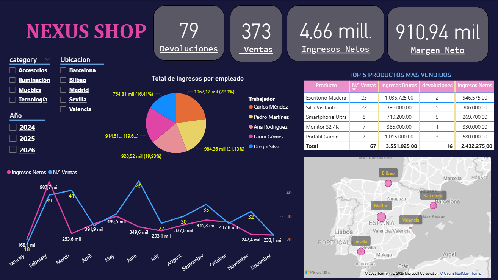
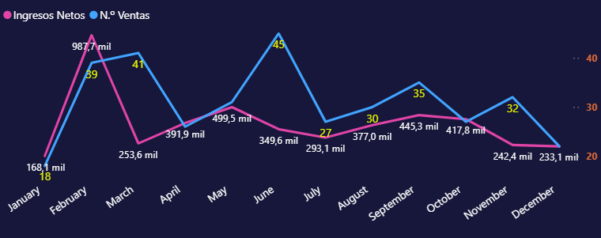
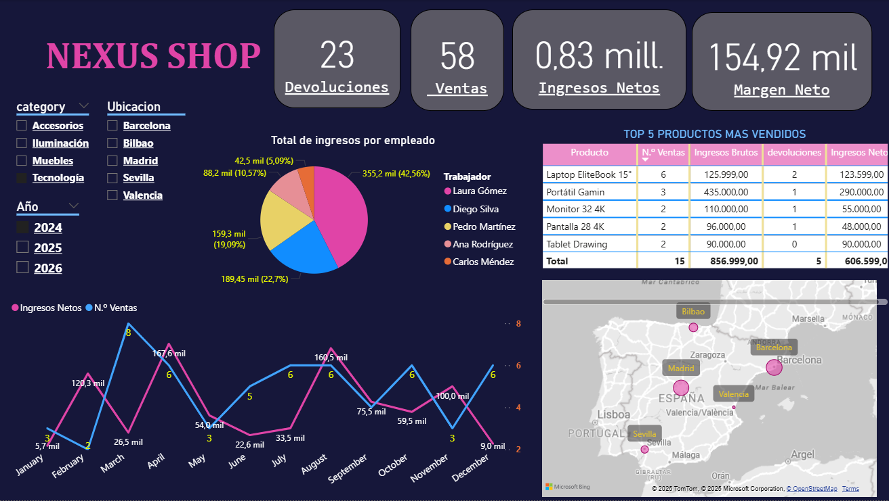

Análisis de Ventas - Tienda E-commerce Nexus Shop
De Datos Crudos a Insights: Pipeline Completo de Análisis con SQL + Power Query + Power BI

## 📊 Resumen del Proyecto
Transformé 5 archivos CSV desorganizados en un dashboard interactivo que muestra tendencias de ventas, comportamiento de clientes y oportunidades de negocio.

## 🔧 Herramientas que utilice
- **SQL** para unir y analizar los datos
- **Power Query** para limpiar y organizar la información  
- **Power BI** para crear gráficos y reportes interactivos

## 📁 Estructura del Proyecto

### [1. Datos Originales](https://github.com/tiagorojas7/Analisis-de-ventas-Tienda-Ecommerce-Nexus-Shop-/tree/main/%3A%201-datos-crudos)
- `clientes.csv` - Base de datos de clientes
- `ventas.csv` - Transacciones comerciales
- `productos.csv` - Catálogo de productos
- `trabajadores.csv` - Información del equipo
- `opiniones.csv` - Feedback y devoluciones

### [2. Consultas SQL](https://github.com/tiagorojas7/Analisis-de-ventas-Tienda-Ecommerce-Nexus-Shop-/tree/main/2-sql-queries)
- [`01_union_tablas.sql`](2-sql-queries/01_union_tablas.sql) - Uniones básicas entre tablas
- [`02_analisis_devoluciones.sql`](2-sql-queries/02_analisis_devoluciones.sql) - Tasa de devolución por producto
- [`03_analisis_ventas_productos.sql`](2-sql-queries/03_analisis_ventas_productos.sql) - Métricas por producto y categoría
- [`04_analisis_empleados.sql`](2-sql-queries/04_analisis_empleados.sql) - Desempeño del equipo comercial
- [`05_analisis_clientes.sql`](2-sql-queries/05_analisis_clientes.sql) - Comportamiento y distribución geográfica
- [`06_consulta_final_dashboard.sql`](2-sql-queries/06_consulta_final_dashboard.sql) - Datos consolidados para Power BI

### [3. Dashboard Power BI](https://github.com/tiagorojas7/Analisis-de-ventas-Tienda-Ecommerce-Nexus-Shop-/tree/main/3-power-bi)
**📊 Dashboard Interactivo Nexus Shop:**
- [`Dashboard Nexus Shop.pbix`](enlace) - Archivo completo interactivo
- [`dashboard_documentation.md`](https://github.com/tiagorojas7/Analisis-de-ventas-Tienda-Ecommerce-Nexus-Shop-/blob/main/3-power-bi/dashboard_documentation.md) - Documentación detallada

**🖼️ Vistas Destacadas:**

*Dashboard completo con filtros por categoría, año y ubicación*

  
*Evolución de ingresos y ventas por mes 

*Filtros en acción: Tecnología 2024 

**🔧 Lo que demuestra:**
- ✅ **Segmentadores interactivos** que responden preguntas específicas
- ✅ **Análisis de tendencias** temporales y por empleado
- ✅ **Top productos** con impacto de devoluciones
- ✅ **Capacidad de drill-down** geográfico y por categoría

### [4. Datos Procesados](https://github.com/tiagorojas7/Analisis-de-ventas-Tienda-Ecommerce-Nexus-Shop-/tree/main?tab=readme-ov-file)
- Dataset final limpio y listo para análisis

### [5. Documentación](https://github.com/tiagorojas7/Analisis-de-ventas-Tienda-Ecommerce-Nexus-Shop-/tree/main?tab=readme-ov-file)
- [`reporte-desempeno-detallado.md`](5-documentacion/reporte-desempeno-detallado.md) - Análisis completo de resultados

## 📈 Resultados y Impacto

### 🎯 Logros Principales
- **3.67M** en ingresos netos generados
- **1.12M** de margen neto alcanzado
- **200** ventas procesadas y analizadas
- **79** devoluciones identificadas como área crítica

### 💡 Insights Estratégicos Descubiertos
1. **📊 Estacionalidad Marcada**: Mayo y Septiembre (+400K) vs Enero (143K)
2. **👥 Concentración de Ventas**: 3 empleados generan 70% de los ingresos
3. **📦 Dependencia de Productos**: Portátil Gamming aporta 580K solo
4. **🔄 Alto Índice Devoluciones**: Smartphone Ultra con mayor tasa de retornos
5. **🌍 Oportunidad Geográfica**: Valencia y Sevilla con potencial de crecimiento

### 🚀 Recomendaciones Clave
- Reducir devoluciones mediante mejoras en calidad/descripciones
- Diversificar cartera de productos y equilibrar desempeño del equipo
- Capitalizar estacionalidad con campañas específicas

**[📖 Ver Análisis Completo](5-documentacion/reporte-desempeno-detallado.md)**

---
Proyecto creado por Tiago Rojas - Analista de Datos
